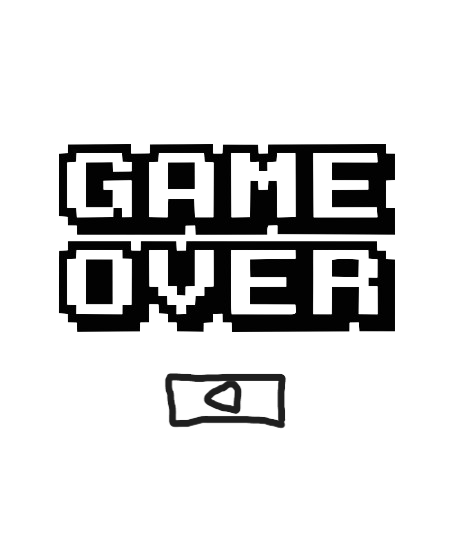

# BÀI TẬP LỚN - PLANE AND BONBS - GAME - SDL2 #(INT2215 - 2324)
## Video Demo: https://www.youtube.com/watch?v=LWByIC2QWQs
## Mô tả về các đối tượng trong trò chơi 
-  **Sprite** là nhân vật chính của trò chơi. Sprite có thể di chuyển theo 2 hướng trái/phải điều khiển của người chơi.
-        **FallingImage** là các đối tượng mà Sprite phải bắn nổ. FallingImage xuất hiện ngẫu nhiên mỗi lần xuất hiện. Bắn nổ FallingImage thì sẽ được cộng điểm.
-    **Boss** là các đối tượng boss mà người chơi phải tiêu diệt sau mỗi level. Tùy vào từng level mà boss càng khó tiêu diệt hơn.
-  là đối tượng mà Sprite bắn ra để tiêu diệt các FallingImage.
-  **Light**  **fireBoss*** là các đối tượng mà các Boss bắn ra để cản trở người chơi.
-  **HP** là đối tượng mà Sprite ăn đẻ hồi máu.
-  **Sheild** là đối tượng Sprite ăn để kích được bất tử.
## Mô tả game play và xử lý va chạm
- Di chuyển   **Sprite** bằng các nút mũi tên ← → và bắn đạn bằng nút f.
- Các     **FallingImage** sẽ rơi từ phía trên xuống.
- Trong một màn chơi, nhiệm vụ của người chơi là điều khiển Sprite , bắn nổ những FaliingImage và ghi điểm , đồng thời né những FallingImage và thu thập điểm với mục tiêu là đạt số điểm để hoàn thành trò chơi nhanh nhất có thể.
- FallingImage sẽ nổ  khi bị bắn trúng và điểm của bạn sẽ tăng lên 1.
- Nếu Sprite va chạm với fallingImage thì máu của Sprite sẽ bị giảm nếu máu về 0 thì trò chơi kết thúc và hiện lên hình ảnh:
  
  
- Nếu muốn chơi lại thì click chuột vào màn hình
- Hãy ăn những:  để được hồi máu khẩn cấp,   để kích hoạt màn chắn bảo vệ  trong 5 giây, trong thời gian đó sprite sẽ dược bất tử.
- Sau mỗi màn chơi thì các    boss sẽ xuất hiện.
- Hạ gục boss mạnh nhất  thì bạn thắng :
  
  
- Để chơi tiếp hãy ấn vào **play again**
## Cách cài đặt project
- Tải game (được nén thành .zip) tại link sau: https://github.com/leducanhtai/projectgamecuoiki/releases/tag/releases
- Cách clone project về máy rất đơn giản, các bạn có thể down file .zip về sau đó giải nén, hoặc có thể tạo 1 folder mới rồi dùng git clone, hoặc đơn giản hơn nũa thì hãy tải git desktop sau đó chép đường link liên kết của project này vào và clone về
- Trong file project đã bao gồm cả các file cần thiết của thư viện SDL2 (có bao gồm SDL2_image, SDL2_mixer) nên rất tiện để các bạn link trực tiếp vào project của mình
- Project được code và build trên Visual Studio , sau khi clone về chỉ cần dùng Local window debugger là game sẽ chạy và tạo file .exe , nếu như các bạn sử dụng IDE khác thì hãy lên mạng và tìm cách build file dành cho IDE đó
## Các kĩ năng áp dụng trong code game
- Kỹ thuật kiểm tra xử lý va chạm.
- Kỹ thuật xử lý thời gian.
- Tách file quản lý code.
- Con trỏ, vector, string,
- Vòng lặp, cấu trúc rẽ nhánh,...
- Thư viện SDL2, SDL_ttf, SĐL_mixer.
## Nguồn tham khảo
- [lazyfoo](https://lazyfoo.net/tutorials/SDL/)

