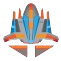

# BÀI TẬP LỚN - PLANE AND BONBS - GAME - SDL2 #(INT2215 - 2324)
## Video Demo: https://www.facebook.com/profile.php?id=100069385633621
## Mô tả về các đối tượng trong trò chơi 
-  là nhân vật chính của trò chơi. Sprite có thể di chuyển theo 2 hướng trái/phải điều khiển của người chơi.
- (img/bom2.png)(img/bom3.png)(img/bom4.png) là các đối tượng mà Sprite phải bắn nổ. FallingImage xuất hiện ngẫu nhiên mỗi lần xuất hiện. Bắn nổ FallingImage thì sẽ được cộng điểm.
- (img/boss2r.png)(img/boss3r.png) là các đối tượng boss mà người chơi phải tiêu diệt sau mỗi level. Tùy vào từng level mà boss càng khó tiêu diệt hơn.
-  là đối tượng mà Sprite bắn ra để tiêu diệt các FallingImage.
- (img/lua2.png) ảnh là các đối tượng mà các Boss bắn ra để cản trở người chơi.
-  là đối tượng mà Sprite ăn đẻ hồi máu.
-  là đối tượng Sprite ăn để kích được bất tử.
## Mô tả game play và xử lý va chạm
- Di chuyển Sprite bằng các nút mũi tên ← → và bắn đạn bằng nút f.
- Các FallingImage sẽ rơi từ trên xuống.
- Trong một màn chơi, Sprite sẽ được người chơi di chuyển, bắn nổ những FaliingImage và ghi điểm , đồng thời né những FallingImage và thu thập điểm với mục tiêu là đạt số điểm cao nhất có thể.
